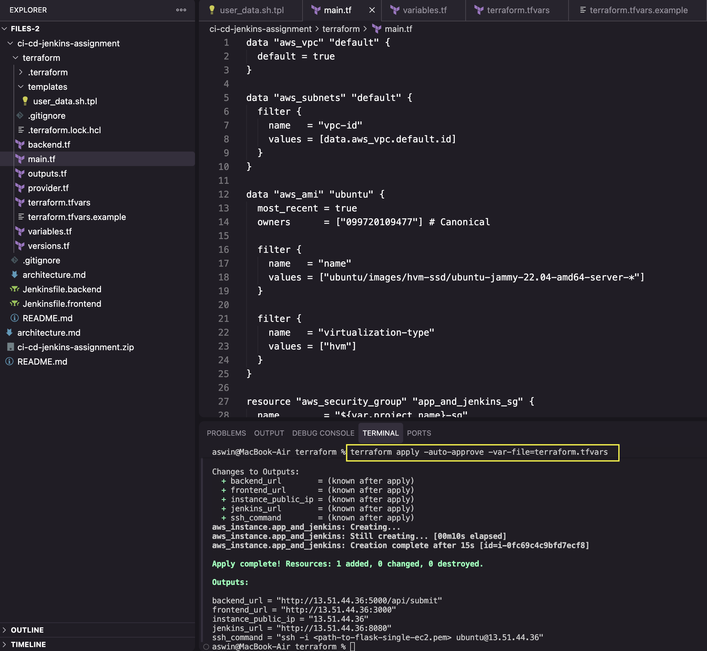
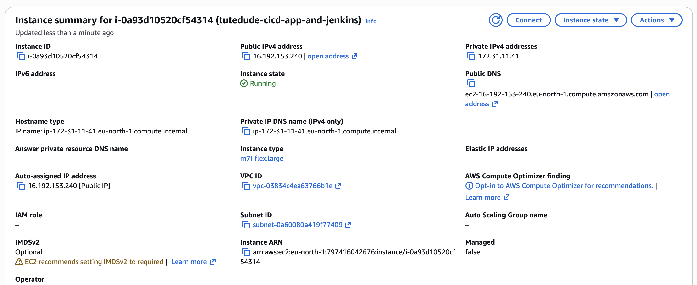
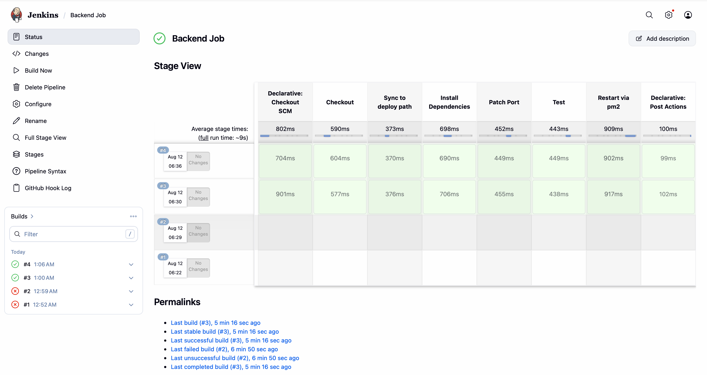
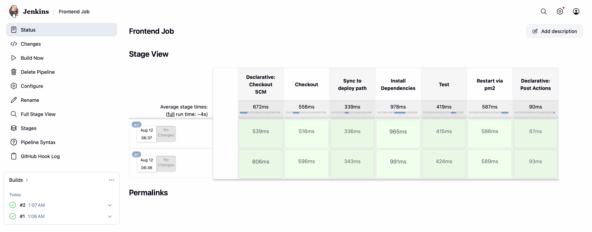
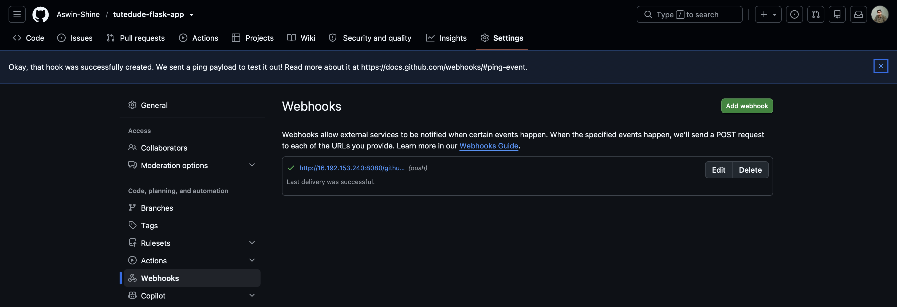
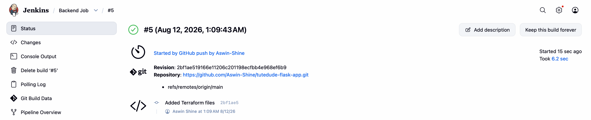
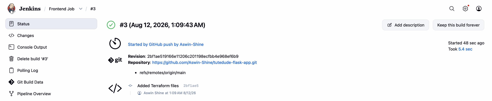
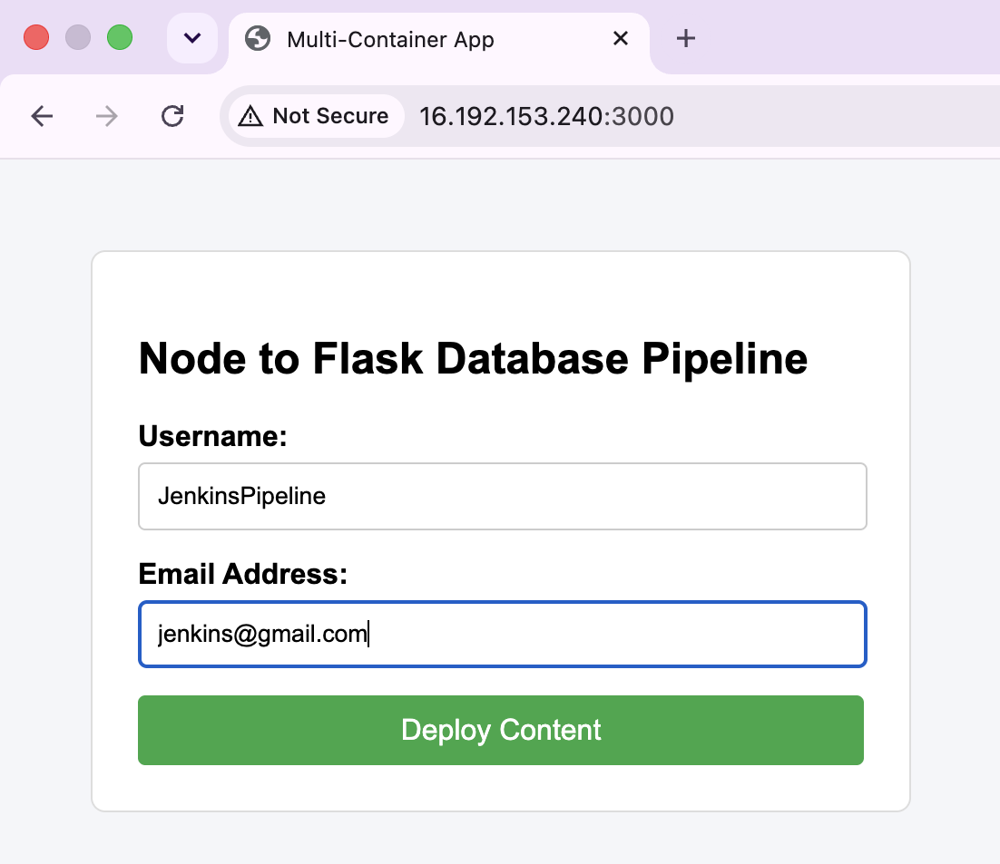
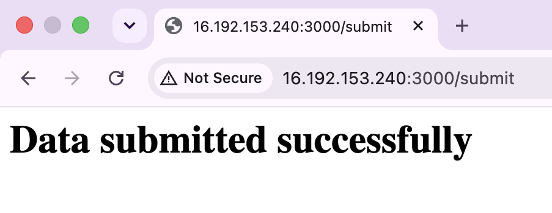

<div align="center">

# Assignment 9 : Jenkins CI/CD Deployment

</div>

**Task 1 : Deploy Flask and Express on a Single EC2 Instance**

Directory Structure
```
flask-app/
├── terraform/
│   ├── main.tf              -- default VPC, security group (22/3000/5000/8080), single EC2
│   ├── templates/
│   │   └── user_data.sh.tpl -- installs Jenkins, Python, Node, pm2; deploys both apps as `jenkins` user
│   ├── variables.tf  outputs.tf  provider.tf  versions.tf  backend.tf
│   └── terraform.tfvars.example
├── Jenkins/
|   ├── Jenkinsfile.backend  -- pipeline for the Flask app 
│   └── Jenkinsfile.frontend -- pipeline for the Express app
|
└── README.md                -- this file
```

---

User Data shell script (terraform/templates/user-data.sh.tpl)
```
#!/bin/bash
set -euxo pipefail
exec > >(tee /var/log/user-data.log) 2>&1

# --- Base dependencies ---
apt-get update -y
apt-get install -y python3 python3-pip python3-venv git curl fontconfig openjdk-21-jdk rsync

curl -fsSL https://deb.nodesource.com/setup_18.x | bash -
apt-get install -y nodejs
npm install -g pm2

# --- Jenkins ---
install -d -m 0755 /usr/share/keyrings
curl -fsSL https://pkg.jenkins.io/debian-stable/jenkins.io-2026.key -o /usr/share/keyrings/jenkins-keyring.asc
echo "deb [signed-by=/usr/share/keyrings/jenkins-keyring.asc] https://pkg.jenkins.io/debian-stable binary/" \
  | tee /etc/apt/sources.list.d/jenkins.list > /dev/null

apt-get update -y
apt-get install -y jenkins
systemctl enable jenkins
systemctl start jenkins

# --- App deploy, all as the jenkins user ---
# Everything below runs as `jenkins` (not root) so that the pm2 daemon
# Jenkins pipeline jobs later talk to via `pm2 restart <app>` is the SAME
mkdir -p /opt/app
chown jenkins:jenkins /opt/app

sudo -u jenkins -H bash <<'JENKINS_USER_EOF'
set -euxo pipefail
cd /opt/app
git clone ${github_repo_url} .

# Backend: venv + deps
cd /opt/app/backend
python3 -m venv venv
./venv/bin/pip install --no-cache-dir -r requirements.txt
# Repo hardcodes port 5001; this assignment wants 5000. Patched here on
# initial boot; the Jenkins pipeline re-applies the same sed after every
# future `git pull`, since a fresh checkout would otherwise revert it.
sed -i "s/port=5001/port=${backend_port}/" app.py

# Frontend: npm deps
cd /opt/app/frontend
npm install --production

# pm2 process definitions -- single source of truth both this initial
# boot AND every Jenkins-triggered restart reference by name.
cat > /opt/app/ecosystem.config.js <<EOF
module.exports = {
  apps: [
    {
      name: "flask-backend",
      script: "app.py",
      interpreter: "/opt/app/backend/venv/bin/python3",
      cwd: "/opt/app/backend",
      env: { MONGO_URI: "${mongo_uri}" }
    },
    {
      name: "express-frontend",
      script: "server.js",
      cwd: "/opt/app/frontend",
      env: { BACKEND_URL: "http://localhost:${backend_port}/api/submit", PORT: "${frontend_port}" }
    }
  ]
}
EOF

pm2 start /opt/app/ecosystem.config.js
pm2 save
JENKINS_USER_EOF

# pm2 startup script -- makes both apps survive a reboot, as `jenkins` user
env PATH=$PATH:/usr/bin pm2 startup systemd -u jenkins --hp /var/lib/jenkins \
  | tail -n 1 | bash

sudo -u jenkins pm2 save

```
--- 

Terraform Files (root folder)

1. Terraform Vars File (terraform.tfvars)
```
aws_region       = "eu-north-1"
project_name     = "tutedude-cicd"
instance_type    = "m7i-flex.large" 
key_name         = "your-ec2-keypair-name"
allowed_ssh_cidr = "YOUR_IP/32"
github_repo_url  = "https://github.com/Aswin-Shine/tutedude-flask-app.git"
backend_port     = 5000
frontend_port    = 3000
jenkins_port     = 8080
mongo_uri        = "mongodb+srv://<user>:<password>@<cluster>.mongodb.net/<db>?retryWrites=true&w=majority"
```

**Explanation**
- Compute Sizing Upgrade: Provisions an m7i-flex.large instance in eu-north-1 to provide sufficient CPU and memory resources for running Jenkins build workloads and containerized services simultaneously.

- CI/CD Automation Setup: Introduces tutedude-cicd project scoping and exposes port 8080 specifically for Jenkins automation server access and pipeline management.

- Application Service Mapping: Links the GitHub repository (Aswin-Shine/tutedude-flask-app.git) and configures active listening ports for Express (3000) and the Flask API (5000).

- Security & Database Integration: Establishes restricted SSH ingress placeholders alongside a dynamic MongoDB Atlas connection string template (mongo_uri) for persistent backend storage.

2. Terraform Variables File (variables.tf)
```
variable "aws_region" {
  description = "AWS region to deploy into"
  type        = string
  default     = "eu-north-1"
}

variable "project_name" {
  description = "Prefix for resource names"
  type        = string
  default     = "tutedude-cicd"
}

variable "instance_type" {
  description = "EC2 instance type. Jenkins + both apps on one box needs real RAM"
  type        = string
  default     = "t3.medium"
}

variable "key_name" {
  description = "Name of an EXISTING EC2 key pair in this region, used for SSH access"
  type        = string
}

variable "allowed_ssh_cidr" {
  description = "CIDR allowed to SSH in. Set to your own IP/32, not 0.0.0.0/0."
  type        = string
}

variable "github_repo_url" {
  description = "HTTPS URL of the app repo (monorepo containing both backend/ and frontend/)"
  type        = string
  default     = "https://github.com/Aswin-Shine/tutedude-flask-app.git"
}

variable "backend_port" {
  description = "Port the Flask backend listens on"
  type        = number
  default     = 5000
}

variable "frontend_port" {
  description = "Port the Express frontend listens on"
  type        = number
  default     = 3000
}

variable "jenkins_port" {
  description = "Port the Jenkins web UI listens on"
  type        = number
  default     = 8080
}

variable "mongo_uri" {
  description = "MongoDB Atlas connection string for the Flask backend."
  type        = string
  sensitive   = true
}

```

**Explanation**
- Compute Sizing Allocation: Sets default instance sizing to t3.medium to supply sufficient RAM for running Jenkins, Docker builds, and the application stack co-located on a single server without running into Out-Of-Memory (OOM) errors.

- CI/CD & Application Port Mapping: Configures dedicated service listening ports for Express (3000), Flask (5000), and the Jenkins CI/CD automation UI (8080).

- Source & Deployment Scope: Establishes parameters for AWS deployment region (eu-north-1), project resource prefix (tutedude-cicd), SSH access constraints, and the monorepo source URL (Aswin-Shine/tutedude-flask-app.git).

- Sensitive Secrets Handling: Defines mongo_uri with sensitive = true and intentionally omits a default value to enforce passing database credentials via secure .tfvars files rather than hardcoding them in source control.


3. Main Terraform File (main.tf)
```
# Using the default VPC/subnet — a dedicated VPC is overkill for a single
# EC2 instance assignment. Flag if this needs to change for Part 2/3.
data "aws_vpc" "default" {
  default = true
}

data "aws_subnets" "default" {
  filter {
    name   = "vpc-id"
    values = [data.aws_vpc.default.id]
  }
}

data "aws_ami" "ubuntu" {
  most_recent = true
  owners      = ["099720109477"] # Canonical

  filter {
    name   = "name"
    values = ["ubuntu/images/hvm-ssd/ubuntu-jammy-22.04-amd64-server-*"]
  }

  filter {
    name   = "virtualization-type"
    values = ["hvm"]
  }
}

resource "aws_security_group" "app_sg" {
  name        = "${var.project_name}-${var.environment}-sg"
  description = "Allow SSH, Flask, and Express traffic"
  vpc_id      = data.aws_vpc.default.id

  ingress {
    description = "SSH"
    from_port   = 22
    to_port     = 22
    protocol    = "tcp"
    cidr_blocks = [var.allowed_ssh_cidr]
  }

  ingress {
    description = "Express frontend"
    from_port   = var.frontend_port
    to_port     = var.frontend_port
    protocol    = "tcp"
    cidr_blocks = ["0.0.0.0/0"]
  }

  ingress {
    description = "Flask backend"
    from_port   = var.backend_port
    to_port     = var.backend_port
    protocol    = "tcp"
    cidr_blocks = ["0.0.0.0/0"]
  }

  egress {
    description = "All outbound"
    from_port   = 0
    to_port     = 0
    protocol    = "-1"
    cidr_blocks = ["0.0.0.0/0"]
  }

  tags = {
    Name = "${var.project_name}-${var.environment}-sg"
  }
}

resource "aws_instance" "app_server" {
  ami                    = data.aws_ami.ubuntu.id
  instance_type          = var.instance_type
  key_name               = var.key_name
  subnet_id              = data.aws_subnets.default.ids[0]
  vpc_security_group_ids = [aws_security_group.app_sg.id]

  user_data = templatefile("${path.module}/templates/user_data.sh.tpl", {
    github_repo_url = var.github_repo_url
    backend_port    = var.backend_port
  })

  # user_data changes should replace the instance, not silently no-op
  user_data_replace_on_change = true

  root_block_device {
    volume_size = 15
    volume_type = "gp3"
    encrypted   = true
  }

  tags = {
    Name = "${var.project_name}-${var.environment}-server"
  }
}

```

**Explanation**
- Default Infrastructure Discovery: Queries the default AWS VPC, default subnets, and latest Canonical Ubuntu 22.04 LTS AMI to streamline deployment without requiring a custom network buildout.

- Unified Access Security Group: Enforces restricted SSH access via var.allowed_ssh_cidr while opening public ingress (0.0.0.0/0) for the Express frontend, Flask backend, and Jenkins CI/CD UI/webhook endpoint (8080).

- Automated Instance Bootstrapping: Provisions the single-server workload via user_data.sh.tpl, passing the application repository URL, listening ports, and MongoDB connection string into template evaluation.

- Expanded Workload Storage Allocation: Attaches a 20GB encrypted gp3 root volume to ensure adequate disk capacity for Jenkins job workspaces, Docker image layers, and build caches.

4. Outputs Terraform File (outputs.tf)
```
output "instance_public_ip" {
  value = aws_instance.app_and_jenkins.public_ip
}

output "frontend_url" {
  value = "http://${aws_instance.app_and_jenkins.public_ip}:${var.frontend_port}"
}

output "backend_url" {
  value = "http://${aws_instance.app_and_jenkins.public_ip}:${var.backend_port}/api/submit"
}

output "jenkins_url" {
  value = "http://${aws_instance.app_and_jenkins.public_ip}:${var.jenkins_port}"
}

output "ssh_command" {
  value = "ssh -i <path-to-${var.key_name}.pem> ubuntu@${aws_instance.app_and_jenkins.public_ip}"
}

```

**Explanation**
- Public IP Exposure: Outputs the public IP of the co-located application and Jenkins EC2 instance for tracking and remote access.

- CI/CD Management Endpoint: Generates the direct web link (http://<public_ip>:8080) to access the Jenkins UI for pipeline management and webhook configuration.

- Application Service Endpoints: Constructs ready-to-use HTTP URLs for accessing the Express web interface (port 3000) and the Flask API endpoint (/api/submit on port 5000).

- Remote Management Connection: Formats a pre-populated SSH command utilizing the dynamic server IP and your specified key pair name for rapid terminal access.

Commands to run :
```
cd terraform
terraform init
terraform plan
terraform apply -auto-approve -var-file=terraform.tfvars
```




---

**Task 2 : Implement CI/CD Pipeline Using Jenkins**
Terraform doesn't configure Jenkins itself, only installs it. These steps
you do once through the UI:

1. SSH into the app server and get the jenkins password for the UI
```
ssh ssh -i <path-to-flask-single-ec2.pem> ubuntu@16.16.141.119
sudo cat /var/lib/jenkins/secrets/initialAdminPassword  # Copy the password
```

2. Open the Jenkins UI using the url from terrafrom output
```
http://<INSTANCE_IP_ADDRESS>:8080
```

3. Install Suggested Plugins (NodeJS Plugin, Pipeline Stageview Plugin)

4. Create a pipeline named Backend Job (Pipeline Script from SCM)
```
// Jenkins job config: Pipeline script path = "Jenkinsfile.backend"
pipeline {
    agent any

    triggers {
        githubPush()
    }

    stages {
        stage('Checkout') {
            steps {
                checkout scm
            }
        }

        stage('Sync to deploy path') {
            steps {
                sh 'rsync -a --delete --exclude venv backend/ /opt/app/backend/'
            }
        }

        stage('Install Dependencies') {
            steps {
                dir('/opt/app/backend') {
                    sh '''
                        if [ ! -d venv ]; then
                            python3 -m venv venv
                        fi
                        ./venv/bin/pip install --no-cache-dir -r requirements.txt
                    '''
                }
            }
        }

        stage('Patch Port') {
            steps {
                dir('/opt/app/backend') {
                    // Repo hardcodes 5001; assignment wants 5000. A fresh
                    // rsync from a clean checkout undoes this every time,
                    // so it's reapplied on every build, not just the first.
                    sh "sed -i 's/port=5001/port=5000/' app.py"
                }
            }
        }

        stage('Test') {
            steps {
                dir('/opt/app/backend') {
                    sh '''
                        if [ -d tests ] || ls test_*.py > /dev/null 2>&1; then
                            ./venv/bin/pip install --no-cache-dir pytest
                            ./venv/bin/pytest || true
                        else
                            echo "No tests found in backend/ -- skipping. Add a tests/ dir or test_*.py files to make this stage do real work."
                        fi
                    '''
                }
            }
        }

        stage('Restart via pm2') {
            steps {
                sh 'pm2 restart flask-backend'
            }
        }
    }

    post {
        failure {
            echo 'Backend pipeline failed -- flask-backend was NOT restarted, previous version keeps running.'
        }
        success {
            echo 'Backend deployed and restarted successfully.'
        }
    }
}

```

**Explanation**
- Automated Webhook Integration: Hooks into SCM updates via githubPush() to automatically trigger the backend deployment pipeline on code commits.

- Source Isolation & Sync: Transfers files from backend/ into /opt/app/backend/ using rsync with --delete, ignoring the existing venv directory to maintain execution environment integrity.

- Virtual Environment Management: Dynamically creates a Python venv if omitted, followed by clean requirement installations via ./venv/bin/pip install --no-cache-dir.

- Runtime Dynamic Configuration: Uses sed to patch app.py, re-mapping the hardcoded default port 5001 to 5000 on every deployment run.

- Conditional Test Discovery & Process Reload: Runs pytest automatically if test suites (tests/ or test_*.py) exist, then issues pm2 restart flask-backend to apply updates without service termination.



5. Create a pipeline named Frontend Job (Pipeline script from SCM)
```
// Jenkins job config: Pipeline script path = "Jenkinsfile.frontend"
pipeline {
    agent any

    triggers {
        githubPush()
    }

    stages {
        stage('Checkout') {
            steps {
                checkout scm
            }
        }

        stage('Sync to deploy path') {
            steps {
                sh 'rsync -a --delete --exclude node_modules frontend/ /opt/app/frontend/'
            }
        }

        stage('Install Dependencies') {
            steps {
                dir('/opt/app/frontend') {
                    sh 'npm install --production'
                }
            }
        }

        stage('Test') {
            steps {
                dir('/opt/app/frontend') {
                    sh '''
                        if node -e "process.exit(require('./package.json').scripts && require('./package.json').scripts.test ? 0 : 1)"; then
                            npm test || true
                        else
                            echo "No test script in package.json -- skipping. Add one to make this stage do real work."
                        fi
                    '''
                }
            }
        }

        stage('Restart via pm2') {
            steps {
                sh 'pm2 restart express-frontend'
            }
        }
    }

    post {
        failure {
            echo 'Frontend pipeline failed -- express-frontend was NOT restarted, previous version keeps running.'
        }
        success {
            echo 'Frontend deployed and restarted successfully.'
        }
    }
}

```
**Explanation**
- Automated Webhook Triggering: Registers the githubPush() trigger to automatically execute the pipeline whenever code is committed to the GitHub repository.

- Atomic Deployment Sync: Uses rsync with --delete and --exclude node_modules to sync the frontend/ source code into /opt/app/frontend/ without blowing away dependencies.

- Production Dependency Management: Executes npm install --production directly inside /opt/app/frontend to ensure node dependencies are installed/updated cleanly without dev overhead.

- Conditional Testing & Process Control: Checks for a test script in package.json before running tests to prevent pipeline crashes, then executes pm2 restart express-frontend to reload the production app zero-downtime style.



6. Add Github Webhook to the github repo
```
repo → Settings → Webhooks → Add webhook → Payload URL → http://<instance-ip>:8080/github-webhook/ → content type → application/json → trigger on push. 
```





---

<div align="center">

## Project Screenshots

</div>





